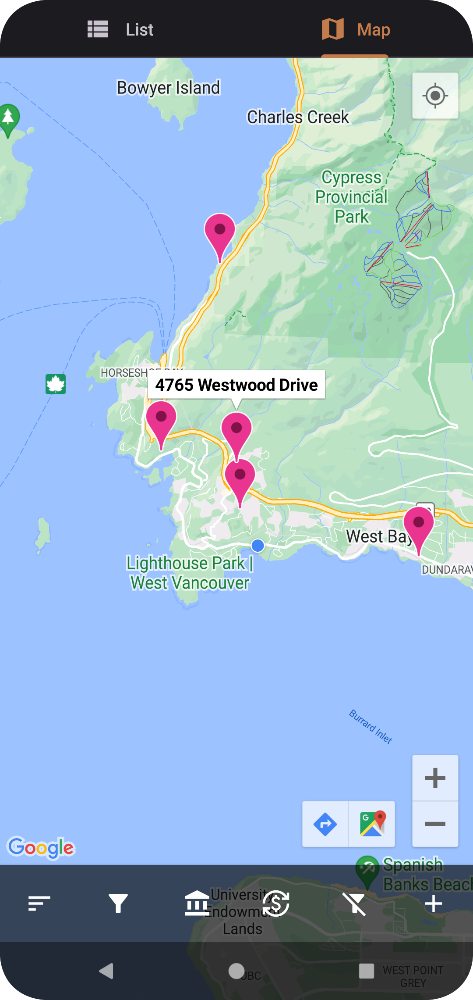
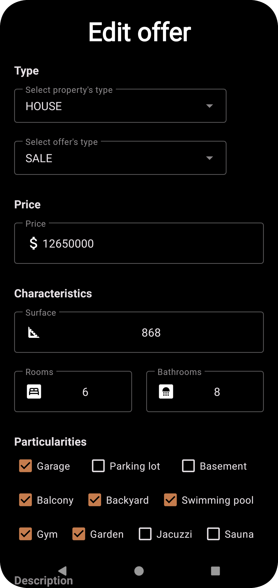

# Go4Lunch

## About
This is my ninth project for Openclassrooms' **Android App Development program**.
This **Native Android App "RealEstateManager"** is, as the name indicates, a real estate management app ordered by a real estate company for attend their specific needs. 

It allows company's personnel to access their real estate offers (sales and rentals), to display an offer in details, to edit an existing offer or to create a new one and assign it to an agent, all from their mobile equipment. It offers also the functionalies to create an new agent profile, to display all real estates in a map view and to simulate a loan. The app is also multi currency view. It has offline Data persistence -done using a SQLite local room database- for offline usage.

## Testing
This source code package incorporates **unit tests** and **instrumentation tests** as well as **HTML results** of these tests.

## Installation
Clone/Download this repository and open it with **Android Studio**
```bash
git clone https://github.com/SimoJOUDAR/P9_RealEstateManager
```

## Run the App
Once the project opened, you can run the App using Android studio's AVD to execute it.

## Obfuscation
The source code has obfuscation and shrinkResources enabled. It uses an external obfuscation dictionary available at https://bit.ly/3uGrnSu

## Generating signed APK
From Android Studio:
1. Go to ***Build*** menu
2. Go to ***Build Bundle(s) / APK(s)***
3. Click on ***Build APK(s)*** The APK generated can be loaded and run on any Android phone.

## Preview
   
   
  

Video_link_coming_soon